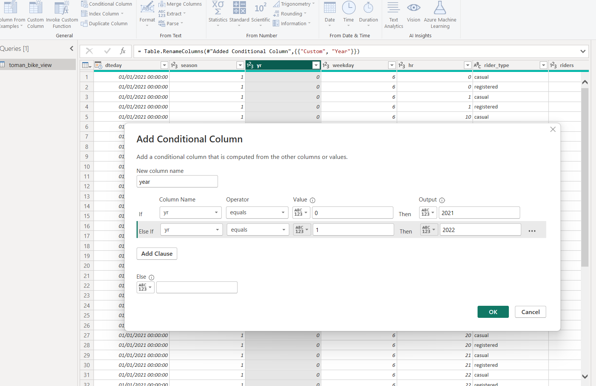
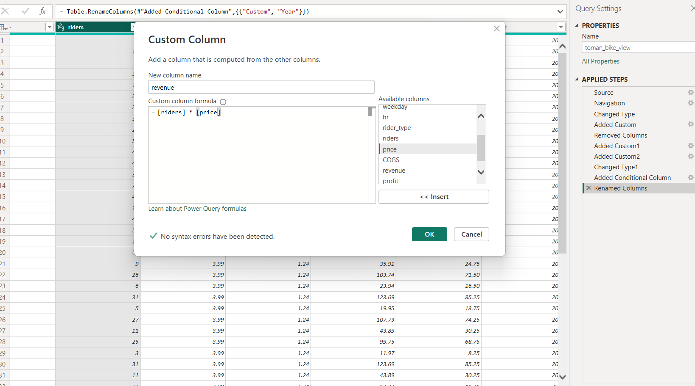

# Toman-Bike-Share-Analysis


# Table of contents

- [Objective](#objective)
  - [User story](#user-story)
- [Data source](#data-source)
- [Stages](#stages)
- [Design](#design)
  - [Dashboard components](#dashboard-components-required)
- [Dashboard mockup](#dashboard-mockup)
- [Tools](#tools)
- [Development](#development)
- [Pseudocode](#pseudocode)
- [Data exploration notes](#data-exploration-notes)
- [Data cleaning](#data-cleaning)
  - [Transform the data](#transform-the-data)
  - [Create the SQL view](#create-the-sql-view)
  - [Column count check](#column-count-check)
  - [Data type check](#data-type-check)
  - [Duplicate count check](#duplicate-count-check)
- [Visualisation](#visualisation)
- [Analysis](#analysis)
  - [Validation](#validation)
  - [Discovery](#discovery)
- [Recommendations](#recommendations)
  - [Potential ROI](#potential-ROI)
  - [Action plan](#action-plan)

# Objective
### User story

   * What is the key point?
Head of marketing from Bike Share sent us the email below:
**Request for Development of Toman Bike Share Dashboard**

Dear Data Analyst,
We need your expertise to develop a dashboard for "Toman Bike Share" that diplays our key performance metrics for informed decision making.

**Requirements**

*  Hourly Revenue Analysis
*  Profit and Revenue Trends
*  Seasonal Revenue
*  Rider Demograpics
**Design and Aesthetics:** Use our company colors and ensure the dasboard is easy to navigate.
**Data Source** Access to our databases will be provided. If no database create one.
**Deadline** We need a preliminary version ASAP
**Please provide an estimated timeline for completion and recommendation on raising prices next year**
Best regards.

# Data source
  *  What data is needed to achieve our objective?
We need data on the sales records of Toman Bike Share which includes their recored:
   *  Work days/hours
   *  Seasons
   *  Years
   *  Riders
   *  Ride types
   *  Prices
   *  Cost of sales
Where is the data coming from? The data has been provided by the comapny, [see here to find it](https://github.com/EthelChila01/Toman-Bike-Share-Analysis/tree/main/assets/docs).
# Stages

   * Design
   * Developement
   * Analysis
# Design
## Dashboard components required
 * What should the dashboard contain based on the requirements provided?
    1. Hourly Revenue Analysis
    2. Profit and Revenue Trends
    3. Seasonal Revenue
    4. Rider Demograpics 
 ## Dashboard mockup

   * What should it look like?
Some of the data visuals that may be appropriate in answering our questions include:

   * Table
   * Clustered bar chart
   * Donut chart
   * Line and clustered column chart
   * Cards
   * Slicer   


## Tools

Tool       | Purpose                                                   |
---------- | ----------------------------------------------------------|
SQL Server | Cleaning and analyzing the data                           |
Power BI   | Visualizing the data via interactive dashboards           |
Mokkup AI  | Designing the wireframe/mockup of the dashboard           |

# Development
## Pseudocode

   * What's the general approach in creating this solution from start to finish?
   * Get the data
   * Load the data into SQL Server
   * Clean the data with SQL
   * Visualize the data in Power BI
   * Generate the findings based on the insights
   * Write the documentation + commentary

### Data exploration notes

This is the stage where we did a scan of what's in the data, errors, inconcsistencies, bugs, weird and corrupted characters etc

   * What are the initial observations with this dataset? What's caught your attention so far?
   1. There are at least nine columns containing the data we need for this analysis, in addition to these columns we will create (profit and revenue). This indicates that we have all the necessary information from the file 
      without needing to contact the client for additional data.
   2. In the cost table, the COGS column is currently set to the date data type, but it should contain monetary values. We need to change the data type of this column to a monetary type and ensure that the resulting decimal 
      places are appropriately formatted.
   3. The price column has too many decimal places and needs to be rounded off.
   4. We have more data than we need, so some of these columns would need to be removed
   5. We noticed that the two tables have the same column names but different records. To ensure all our data is consolidated and easy to use, we will combine the two tables.
   6.We observed that the year column does not accurately indicate the year; it only contains values of 0 or 1. After investigation, we found that 0 corresponds to 2021, while 1 corresponds to 2022. This representation needs to 
     be updated.
## Transform the data
### Data exploration notes

*   We created a database
*  We thoroughly examined the tables and their data to determine what needed to be addressed.
*   We employed the UNION operator to combine the two tables into a single result set. By using UNION (rather than UNION ALL), we guarantee that there are no duplicate rows.
*   created a CTE inoder to connect the newly combined table with the cost table
*   We had to incorporate a third table to work with its data alongside the two tables we connected earlier. After examining the tables, we found that the common column among all of them is the year column. We used this column 
   to join the tables. To ensure we retained all records from our main table (the CTE), we used a LEFT JOIN to match it with the cost table, bringing back all rows from the main table and matching them with the corresponding 
   rows in the cost table.
*   We then selected the specific columns needed for our assignment
*   Rounded the price column to two decimal places
*    The we noticed the cogs column had the time data type so we went ahead and changed it to decimal then later changed to money in power query
*    We noticed that the COGS column had the time data type, so we changed it to decimal. Later, in Power Query, we converted it to the money data type.


#### Our SQL queries

```sql


CREATE DATABASE toman_bike_db
USE toman_bike_db

CREATE VIEW toman_bike_view AS
WITH combined_years_table AS 
(
SELECT * 
FROM bike_share_yr_0
UNION
SELECT * 
FROM bike_share_yr_1
)
SELECT 
dteday,
season,
combined_years_table.yr,
weekday,
hr,rider_type,
riders,
round(price, 2) AS price,
CONVERT(DECIMAL(7, 2),
        CAST(DATEPART(HOUR, COGS) AS VARCHAR(2)) + '.' +
        RIGHT('00' + CAST(DATEPART(MINUTE, COGS) AS VARCHAR(2)), 2)
    ) AS COGS

FROM combined_years_table 
LEFT JOIN cost_table
ON combined_years_table.yr = cost_table.yr

```
#### Our updates in power query


*   The representation of the years in the year column was updated in Power Query using conditional formatting this way;

     *   
      
*   We created the revenue column this way;

    *   

*   We created profit column this way because our COGS (Cost of Goods Sold) is a per-rider cost rather than a total cost;
  
   *   


Visualization
Results
What does the dashboard look like?
# Analysis


1. 

2. 
3.   

4.   
5.
6. to get the revenue we did riders * price
7. for the profit we did riders * price - COGS

# Recommendation
**Conversation Increase:** Considering the substantial increase last year, a more conservative increase might be prudentto avoid hitting a price ceiling where demand starts to drop. An increase in the range of 10-15% could test the market's response without risking a significant loss of customers.
**Price Setting:**
   *  If the price in 2022 was £4.99, a 10% increase would make the new price about $5.49.
   *  A 15% increae would set the price at approximately £5.74.
### Recommended Strategy
**Market Analysis:** Conduct further market research to understand customer satisfaction, potential competitive changes, and the overall economic environment. This can guide whether leaning towards the lower or higher end of the suggested increase.
**Segmented Pricing Strategy** Consider different pricing for casual versus registered users, as they may have different price sensitivities.
**Monitor and Adjust:** Implement the new prices but be ready to adjust based on immediate customer feedback and sales data. Monitoring closely will allow you to fine-tune your pricing strategy without committing fully to a price that might out to be too high.
